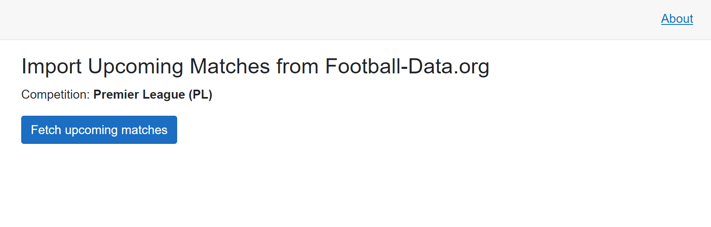

# ⚽ Football Predictor

An explainable football match outcome predictor with backtesting support.
Built with .NET 8, Blazor Server, EF Core, and SQLite.

Unlike black-box ML models, every prediction in this project is derived from
a transparent scoring algorithm — you can trace each number back to the
underlying data and weights.

## 📸 Screenshots
### Home page — upcoming and finished matches


### Prediction card — probabilities, factors, and explanations


### Model performance — accuracy and confidence calibration


### API Import — fetching data from Football-Data.org


## ✨ Features

- **Two real data sources** — Football-Data.co.uk (historical CSV) and Football-Data.org (upcoming matches via API).
- **Explainable algorithm** — weighted scoring across form, attack, defense, and home advantage. Every prediction comes with per-factor breakdown.
- **Backtesting engine** — evaluates the model on 350+ historical matches using only data available *before* each match.
- **Confidence calibration** — predictions are bucketed by confidence level (Low / Medium / High) and accuracy is reported per bucket.
- **Automatic deduplication** — team names are normalized across sources; matches are deduplicated by external ID and (teams, date).
- **CSV + API import** — ready-to-run import pages for both sources.

## 📊 Data Sources

### 1. Football-Data.co.uk (historical results)

- **URL:** https://www.football-data.co.uk/englandm.php
- **Format:** CSV, one file per season (`E0.csv` for Premier League)
- **Fields used:** date, teams, goals, shots, shots on target, corners, Bet365 odds
- **Role:** provides the training ground — all past matches used for form calculation and backtesting

### 2. Football-Data.org API (upcoming matches)

- **URL:** https://www.football-data.org
- **Endpoint:** `/v4/matches?competitions=PL&dateFrom=...&dateTo=...`
- **Auth:** `X-Auth-Token` header
- **Role:** supplies upcoming Premier League fixtures to predict

Both sources are free; Football-Data.org requires a free registration to get an API key.

## 🛠 Tech Stack

| Layer | Technology |
|---|---|
| Language | C# 12 / .NET 8 |
| UI | Blazor Server |
| ORM | Entity Framework Core 8 |
| Database | SQLite |
| CSV parsing | CsvHelper |
| HTTP client | `HttpClient` via `IHttpClientFactory` |
| DI | Built-in ASP.NET Core DI |

No JavaScript frameworks. The entire UI is C#.


## 🧠 How the Algorithm Works

The model is a **weighted linear scoring function**. It produces three raw scores
(home, draw, away), normalizes them into probabilities, and derives confidence
and risk from the result.


### 1. Features

For each team, the last 5 finished matches before the predicted match are used.

| Feature | Formula | Range |
|---|---|---|
| **Form** | `(3×W + 1×D) / (3×N)` | 0..1 |
| **Attack** | `avg goals scored` | 0..∞ (clamped to 3) |
| **Defense** | `avg goals conceded` | 0..∞ (clamped to 3) |

All features are normalized to 0..1:
- Attack → `min(avg_scored / 3, 1)`
- Defense → `max(1 − avg_conceded / 3, 0)` (inverted: fewer conceded = higher score)

### 2. Weights

| Factor | Weight |
|---|---|
| Form | 0.35 |
| Attack | 0.20 |
| Defense | 0.20 |
| Home advantage | 0.15 |

Weights sum to 1.0 after normalization.

### 3. Scoring

```
homeScore = w_form·homeForm + w_attack·homeAttack + w_defense·homeDefense + w_home·0.70
awayScore = w_form·awayForm + w_attack·awayAttack + w_defense·awayDefense + w_home·0.30

drawScore = w_form·(1 − |homeForm − awayForm|)·0.5
          + w_attack·(1 − |homeAttack − awayAttack|)·0.5
          + w_defense·(1 − |homeDefense − awayDefense|)·0.5
          + w_home·0.25
```

The draw score peaks when the two teams are similar. The `0.5` multiplier
prevents draws from dominating the prediction — a corrective measure added
after the initial model over-predicted draws.

### 4. Normalization

```
total     = homeScore + drawScore + awayScore
homeProb  = homeScore / total
drawProb  = drawScore / total
awayProb  = awayScore / total
```

Probabilities always sum to 1.0.

### 5. Confidence

```
gap        = maxProb − secondProb
confidence = round(50·maxProb + 50·gap)
```

Confidence combines the *absolute* probability of the leader and its *gap*
from the runner-up. A confident-looking 0.55 with a 0.05 gap gets ~30;
a dominant 0.85 with a 0.65 gap gets ~75.

### 6. Risk level

| Max probability | Risk |
|---|---|
| > 0.65 | Low |
| 0.45 – 0.65 | Medium |
| ≤ 0.45 | High |


## 📈 Model Performance

Backtested on the 2024/25 Premier League season (`E0.csv`).

| Metric | Value |
|---|---|
| Predictions evaluated | **350** |
| Correct | **170** |
| Accuracy | **48.6%** |

### By confidence level

| Confidence | Count | Correct | Accuracy |
|---|---|---|---|
| High (≥ 70) | 0 | 0 | — |
| Medium (40–69) | 22 | 13 | **59.1%** |
| Low (< 40) | 328 | 157 | 47.9% |

**Interpretation:** the model is correctly calibrated — Medium-confidence
predictions perform ~11 percentage points better than Low-confidence ones.
High-confidence predictions are rare (0 in this run), suggesting the model
is conservative — a desirable property for a prototype without external
signals like injuries or lineups.

> ⚠️ **Disclaimer:** this is an educational prototype. It does **not**
> provide financial or betting advice. No real money is involved. Odds
> from the CSV are used as *informational signals only* and are not
> part of the current scoring algorithm.


## 🚀 Getting Started

### Prerequisites

- [.NET 8 SDK](https://dotnet.microsoft.com/download/dotnet/8.0)
- A free [Football-Data.org API key](https://www.football-data.org/client/register)

### 1. Clone the repository

```bash
git clone https://github.com/Acha1a/Football_Predictions.git
cd Football_Predictions
```

### 2. Configure the API key

Copy `appsettings.json` and add your key:

```json
{
  "FootballDataOrg": {
    "ApiKey": "your_api_key_here"
  }
}
```

Or use User Secrets (recommended):

```bash
dotnet user-secrets init
dotnet user-secrets set "FootballDataOrg:ApiKey" "your_api_key_here"
```

### 3. Download historical data

Download the CSV for the season you want from
[football-data.co.uk/englandm.php](https://www.football-data.co.uk/englandm.php)
and place it in `Data/Import/E0_2425.csv`.

### 4. Run the app

```bash
dotnet run
```

Open `https://localhost:7231` in your browser.

### 5. Import data

1. Go to `/import` → enter `E0_2425.csv` → click **Import**.
2. Go to `/api-import` → click **Fetch upcoming matches**.

### 6. Run a backtest

1. Go to `/backtest`.
2. Select the range `01.08.2024 – 01.06.2025`.
3. Click **Run backtest**.
4. Visit `/performance` to see the accuracy breakdown.


## 🧪 What is *not* in scope

- No real-money betting or wagering.
- No attempt to beat the bookmaker — market odds are used as informational
  signals only.
- No player-level data (injuries, lineups, fatigue).
- No live in-play prediction.

