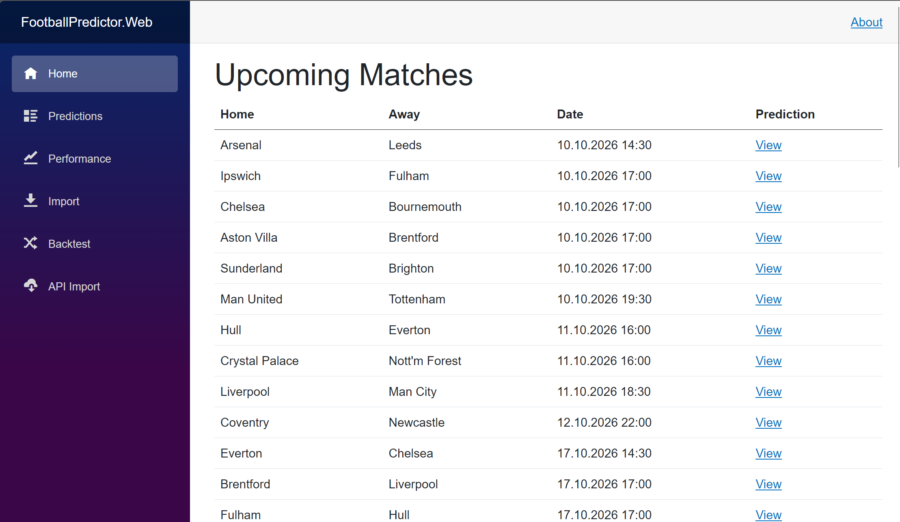
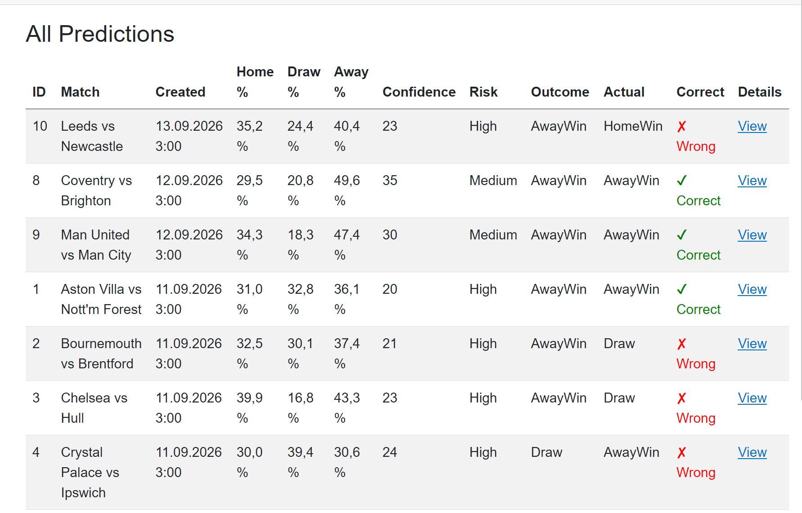
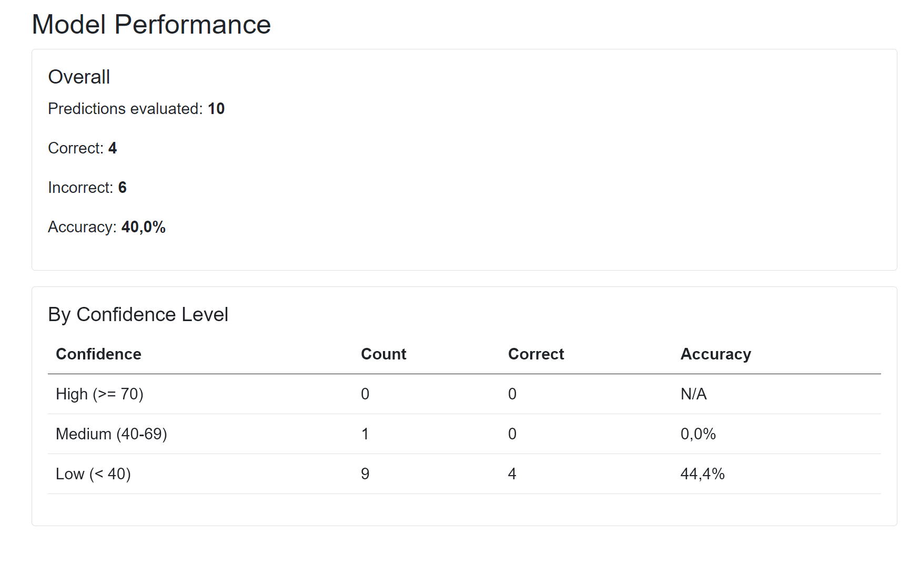

# ⚽ Football Predictor

An explainable football match outcome predictor with backtesting support.
Built with .NET 8, Blazor Server, EF Core, and SQLite.

Unlike black-box ML models, every prediction in this project is derived from
a transparent scoring algorithm — you can trace each number back to the
underlying data and weights.

## 📸 Screenshots
### Home page — upcoming and finished matches

### Prediction card — probabilities, factors, and explanations

### Model performance — accuracy and confidence calibration

### API Import — fetching data from Football-Data.org

